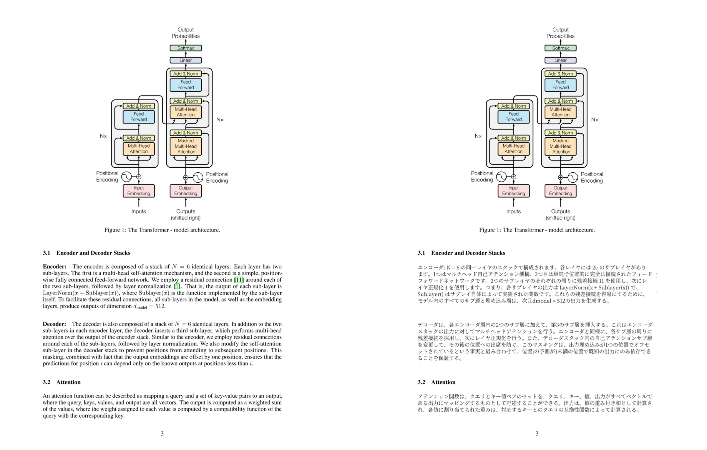

# PDF Translator EN-JA

<p align="center">
  
</p>

<h5 align="center">
  This repository offers an WebUI and API endpoint that translates English PDF files into Japanese, preserving the original layout.
</h5>

<p align="center">
  
</p>

## Features

To be more readable, the translated PDF file displays the original PDF page in the left side and the translated text in the right side (see the image above).

To speed up the translation process, **translation is performed until "References" section in the PDF file**. After that, the rest of the page is copied as it is.

This repository contains some unsolved issues. Pull requests for improvements are always welcome.

## Installation

1. **Clone this repository**

```bash
   git clone https://github.com/discus0434/pdf-translator.git
   cd pdf-translator/docker
```

2. **Build the docker image via Makefile**

```bash
   make build
```

3. **Run the docker container via Makefile**

```bash
   make run
```

## GUI Usage

Access to GUI via browser.

```bash
http://localhost:8288
```

## CLI Usage

```bash
cd pdf-translator/docker && make translate INPUT="path/to/input_pdf_or_dir"
```

You can throw a PDF file or a directory containing PDF files.

The translated PDF files will be saved in `./outputs` directory.

## Requirements

- NVIDIA GPU **(currently only support NVIDIA GPU)**
- Docker

## License

**This repository does not allow commercial use.**

This repository is licensed under CC BY-NC 4.0. See [LICENSE](./LICENSE.md) for more information.

## References

- For PDF layout analysis, using [DiT](https://github.com/microsoft/unilm).

- For PDF to text conversion, using [PaddlePaddle](https://github.com/PaddlePaddle/PaddleOCR) model.

- For text translation, using [FuguMT](https://huggingface.co/staka/fugumt-en-ja) model from [HuggingFace](https://huggingface.co/).

  FuguMT models are distributed under the CC BY-SA 4.0 license. Please also note that the use is clearly stated as "for research purposes only" and that "no responsibility is assumed for operation or output".

- Font files are from [Source Han Serif](https://github.com/adobe-fonts/source-han-serif).

## TODOs

- [ ] Make possible to highlight the translated text
- [ ] Support M1 Mac or CPU

## Contributors

Thanks to the following people who have contributed to this project:

- [Akira Ishino](https://github.com/stn): Improvements on text truncation algorithm
- [hibit](https://github.com/hibit-at): Implementation of directory input to `translator.py`
